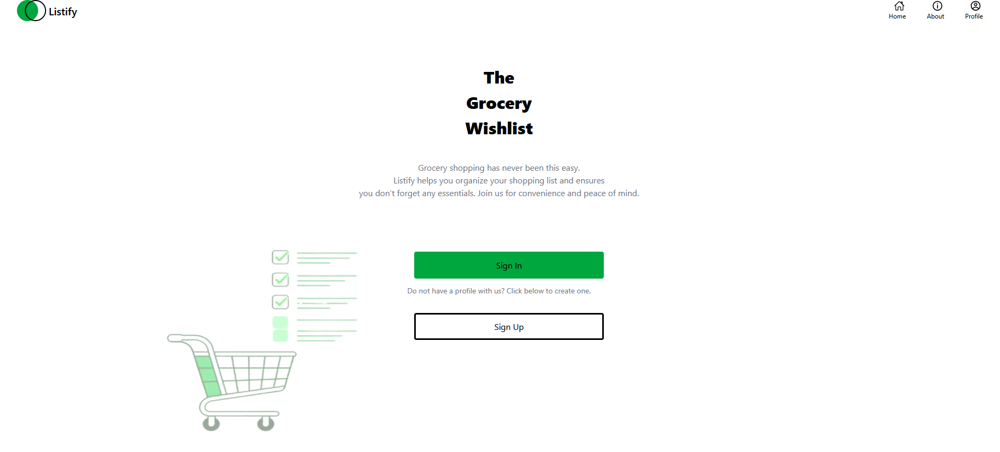
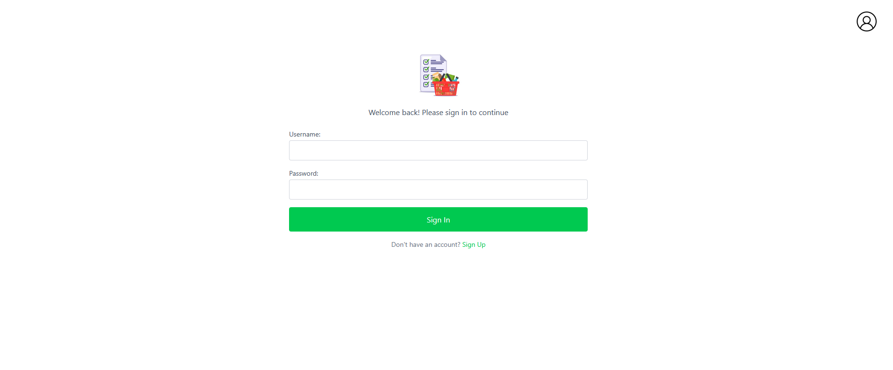
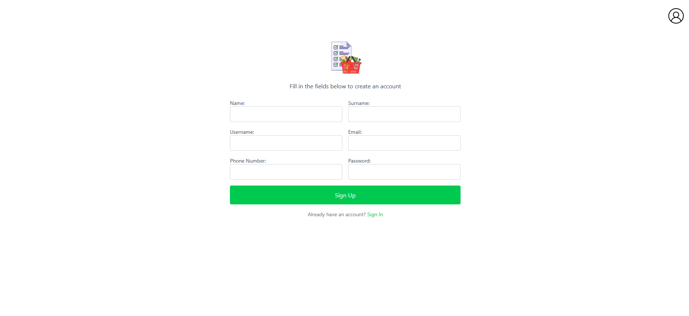

# React Redux Shopping List App

## Project Overview

This project is a Shopping List Web Application built using React and Redux for state management.  
The application allows users to add, edit, delete, and sort shopping list items.  
It was developed as part of Task 5 – React Redux Shopping List App.

---

## Objectives

- Create a user-friendly shopping list interface  
- Implement global state management using Redux  
- Allow users to:
  - Add shopping items  
  - Edit existing items  
  - Delete items  
  - Sort and search items  

---

## Technologies Used

- React (Vite)
- TypeScript
- Redux
- CSS
- ESLint

---

## Features

- Add new shopping list items  
- Edit existing items  
- Delete items  
- Search and sort functionality  
- Modal popups for actions  
- Responsive navigation bar  
- Clean and simple interface  

---

## Project Structure

src/
│── assets/
│ ├── icons/
│ └── images/
│
│── components/
│ ├── ItemRow.tsx
│ ├── ListCard.tsx
│ ├── Modal.tsx
│ ├── Navbar.tsx
│ ├── SigninButton.tsx
│ ├── SignupButton.tsx
│ └── SortSearchBar.tsx
│
│── pages/
│── redux/
│── utils/
│
│── App.tsx
│── main.tsx
│── App.css
│── index.css


---

## Redux Implementation

Redux is used to manage the shopping list state globally.

Reducers handle:
- Adding items  
- Editing items  
- Deleting items  
- Sorting and filtering items  

---
## Screenshots

### Home Page


### Sign Up Page


### Sign In Page


## How to Run the Project

### 1. Install dependencies
```bash
npm install
2. Start the development server
npm run dev
3. Open in browser
The terminal will display a local URL (usually http://localhost:5173)

---

## Screenshots

### Home Page


### Sign Up Page


### Sign In Page


